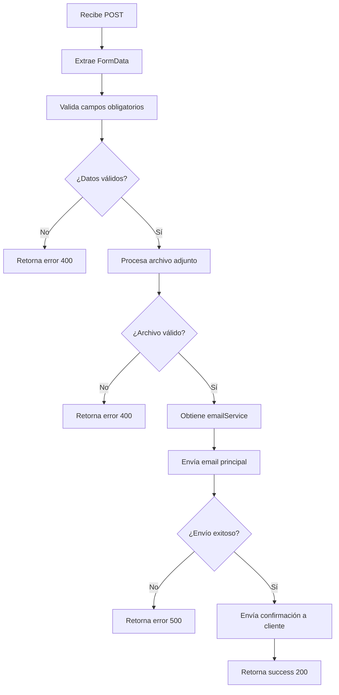

# 📧 Documentación del Servicio de Envío de Emails

## 📋 Índice
- [Visión General](#visión-general)
- [Arquitectura del Sistema](#arquitectura-del-sistema)
- [Componentes Principales](#componentes-principales)
- [Flujo de Datos](#flujo-de-datos)
- [Configuración](#configuración)
- [Casos de Uso](#casos-de-uso)

---

## 🎯 Visión General

Este proyecto implementa un **sistema modular de envío de emails** para el formulario de consultas del Portal de Negocios. El sistema está diseñado con una arquitectura de **separación de responsabilidades** que facilita el mantenimiento, testing y escalabilidad.

### Características principales:
- ✅ Envío de emails usando SMTP de Hostinger
- ✅ Soporte para archivos adjuntos (PDF, imágenes y documentos Word)
- ✅ Validación de datos en el servidor
- ✅ Email de confirmación automático al cliente
- ✅ Arquitectura modular con hooks y servicios separados
- ✅ Manejo robusto de errores

---

## 🏗️ Arquitectura del Sistema

El sistema está organizado en **4 capas principales**:

```
┌─────────────────────────────────────────────────┐
│           CAPA DE PRESENTACIÓN (UI)             │
│  ConsultationForm.jsx - Componente React        │
└─────────────────┬───────────────────────────────┘
                  │
                  ▼
┌─────────────────────────────────────────────────┐
│            CAPA DE LÓGICA (HOOKS)               │
│  useConsultationForm.js - Gestión formulario    │
│  useConsultationSubmit.js - Gestión envío       │
└─────────────────┬───────────────────────────────┘
                  │
                  ▼
┌─────────────────────────────────────────────────┐
│          CAPA DE SERVICIO (API CLIENT)          │
│  consultationService.js - Cliente API           │
└─────────────────┬───────────────────────────────┘
                  │
                  ▼
┌─────────────────────────────────────────────────┐
│            CAPA DE API (BACKEND)                │
│  send-consultation-simple.js - Endpoint API     │
└─────────────────┬───────────────────────────────┘
                  │
                  ▼
┌─────────────────────────────────────────────────┐
│         CAPA DE INFRAESTRUCTURA                 │
│  emailService.js - Servicio SMTP (Nodemailer)   │
└─────────────────────────────────────────────────┘
```

---

## 🧩 Componentes Principales

### 1️⃣ **ConsultationForm.jsx** (Capa de Presentación)
**Ubicación:** `src/components/forms/ConsultationForm.jsx`

**Responsabilidad:** Renderizar la interfaz del formulario y coordinar los hooks.

**Características:**
- Formulario con campos: nombre, apellido, email, teléfono, mensaje
- Campos opcionales adicionales con toggle
- Carga de archivos (PDF, imágenes y documentos Word)
- Mensajes de validación en tiempo real
- Estados de envío (loading, success, error)

**Hooks utilizados:**
```javascript
import { useConsultationForm } from '../../hooks/useConsultationForm';
import { useConsultationSubmit } from '../../hooks/useConsultationSubmit';

// Gestión del formulario
const {
  formData,
  errors,
  showAdditionalFields,
  handleInputChange,
  validateForm,
  resetForm,
  toggleAdditionalFields
} = useConsultationForm();

// Gestión del envío
const {
  isSubmitting,
  submitStatus,
  submitConsultation
} = useConsultationSubmit();
```

---

### 2️⃣ **useConsultationForm.js** (Hook de Gestión del Formulario)
**Ubicación:** `src/hooks/useConsultationForm.js`

**Responsabilidad:** Gestionar el estado del formulario y sus validaciones.

**Funciones exportadas:**

| Función | Descripción |
|---------|-------------|
| `formData` | Estado del formulario con todos los campos |
| `errors` | Objeto con errores de validación |
| `showAdditionalFields` | Booleano para mostrar campos adicionales |
| `handleInputChange()` | Maneja cambios en inputs y limpia errores |
| `validateForm()` | Valida todos los campos requeridos |
| `resetForm()` | Resetea el formulario al estado inicial |
| `toggleAdditionalFields()` | Muestra/oculta campos adicionales |

**Validaciones implementadas:**
- ✅ Nombre y apellido requeridos
- ✅ Email requerido y formato válido
- ✅ Teléfono con formato válido (opcional)
- ✅ Mensaje requerido

---

### 3️⃣ **useConsultationSubmit.js** (Hook de Envío)
**Ubicación:** `src/hooks/useConsultationSubmit.js`

**Responsabilidad:** Gestionar el proceso de envío de consultas a la API.

**Funciones exportadas:**

| Función | Descripción |
|---------|-------------|
| `isSubmitting` | Booleano indicando si está enviando |
| `submitStatus` | Estado del envío ('success', 'error', null) |
| `submitConsultation()` | Envía la consulta al servidor |
| `resetSubmitStatus()` | Resetea el estado del envío |

**Flujo de envío:**
```javascript
const handleSubmit = async (e) => {
  e.preventDefault();
  
  if (!validateForm()) return;
  
  const result = await submitConsultation(formData, showAdditionalFields);
  
  if (result.success) {
    resetForm();
  }
};
```

---

### 4️⃣ **consultationService.js** (Cliente API)
**Ubicación:** `src/services/consultationService.js`

**Responsabilidad:** Comunicación con la API del servidor.

**Funciones principales:**

#### `sendConsultation(formData, hasAdditionalFields)`
Envía una consulta al endpoint de la API.

```javascript
// Crea un FormData con todos los campos
// Soporta archivos adjuntos
// Retorna Promise con resultado
```

#### `isValidEmail(email)`
Valida formato de email usando regex.

#### `isValidPhone(phone)`
Valida formato de teléfono internacional.

---

### 5️⃣ **send-consultation-simple.js** (Endpoint API)
**Ubicación:** `src/pages/api/send-consultation-simple.js`

**Responsabilidad:** Procesar consultas, validar datos y coordinar envío de emails.

**Proceso paso a paso:**



**Validaciones implementadas:**

| Validación | Descripción |
|------------|-------------|
| Campos obligatorios | firstName, lastName, email, message |
| Formato email | Regex: `/^[^\s@]+@[^\s@]+\.[^\s@]+$/` |
| Tipo de archivo | PDF, JPG, JPEG, PNG, GIF, DOC, DOCX |
| Tamaño archivo | Máximo 30MB |

**Configuración Astro:**
```javascript
export const prerender = false; // SSR habilitado
```

---

### 6️⃣ **emailService.js** (Servicio SMTP)
**Ubicación:** `src/services/email/emailService.js`

**Responsabilidad:** Gestionar el envío real de emails vía SMTP usando Nodemailer.

**Patrón de diseño:** Singleton (una única instancia)

#### Métodos principales:

##### `initializeTransporter()`
Inicializa la conexión SMTP con Hostinger.

**Configuración:**
```javascript
{
  host: 'smtp.hostinger.com',
  port: 465,
  secure: true,
  auth: {
    user: import.meta.env.SMTP_USER,
    pass: import.meta.env.SMTP_PASS
  },
  tls: {
    rejectUnauthorized: false
  }
}
```

**Logging detallado:**
- Muestra todos los parámetros de configuración (sin exponer credenciales)
- Verifica si las credenciales están configuradas
- Prueba la conexión SMTP con `verify()`
- Registra errores con stack trace completo

##### `getTransporter()`
Obtiene el transportador SMTP (lo inicializa si es necesario).

**Características mejoradas:**
- Inicializa el transportador la primera vez que se llama
- **Lanza error descriptivo** si falla la inicialización
- Error incluye mensaje: "Verifica las variables de entorno SMTP_USER y SMTP_PASS"
- Garantiza que nunca se retorna `null` sin notificar

##### `sendConsultationEmail(formData, document)`
Envía el email principal con la consulta.

**Características:**
- Genera HTML personalizado con estilos
- Incluye versión texto plano (fallback)
- Soporta archivos adjuntos
- Formatea fecha en zona horaria Argentina

**Estructura del email:**
```
┌──────────────────────────────────────┐
│ 🏢 Portal de Negocios                │
│ Nueva consulta recibida              │
├──────────────────────────────────────┤
│ Fecha: [timestamp Argentina]         │
│                                      │
│ Nombre Completo: Juan Pérez          │
│ Email: juan@example.com              │
│ Teléfono: +54 9 11 1234-5678         │
│                                      │
│ 📝 Mensaje / Consulta:               │
│ [contenido del mensaje]              │
│                                      │
│ 📋 Información Adicional (opcional)  │
│ [datos adicionales]                  │
│ 📎 Documento adjunto (si existe)     │
├──────────────────────────────────────┤
│ Portal de Negocios                   │
│ Servicios Financieros                │
│ En colaboración con Grupo Alpes      │
└──────────────────────────────────────┘
```

##### `sendConfirmationEmail(clientEmail, clientName)`
Envía email de confirmación al cliente.

**Características:**
- Email automático de agradecimiento
- Información sobre próximos pasos
- No bloquea si falla (try-catch)
- **Logging detallado en cada paso del proceso:**
  - `[sendConfirmationEmail]` Inicio del envío
  - Email destino y nombre del cliente
  - Estado del transportador SMTP
  - Resultado del envío (success/error con messageId)
  - Stack trace completo en caso de error

**Contenido del email:**
```
✅ Consulta recibida - Portal de Negocios

Hola [Nombre],

Recibimos tu consulta exitosamente y nuestro equipo 
se pondrá en contacto contigo a la brevedad.

¿Qué sigue?
- 📋 Revisaremos tu consulta en detalle
- 📞 Te contactaremos en las próximas 24-48 horas
- 💡 Te presentaremos las mejores opciones disponibles
```

##### `testConnection()`
Prueba la conexión SMTP y envía un email de test.

**Uso:**
```javascript
const emailService = getEmailService();
const result = await emailService.testConnection();
```

---

## 🔄 Flujo de Datos Completo

### Envío exitoso de consulta:

```
1. Usuario completa formulario
   └─> ConsultationForm.jsx
       │
2. Validación local (useConsultationForm)
   └─> Campos requeridos, formatos válidos
       │
3. Submit (useConsultationSubmit)
   └─> submitConsultation(formData)
       │
4. Cliente API (consultationService)
   └─> POST /api/send-consultation-simple
       │
5. Endpoint API valida datos
   └─> Campos obligatorios, formato email, archivo
       │
6. Procesa archivo adjunto
   └─> Convierte a Buffer, valida tamaño/tipo
       │
7. Obtiene emailService
   └─> Singleton instance
       │
8. Envía email principal
   └─> sendConsultationEmail()
       ├─> Genera HTML personalizado
       ├─> Adjunta documento (si existe)
       └─> Envía vía SMTP Hostinger
       │
9. Envía confirmación al cliente
   └─> sendConfirmationEmail()
       ├─> Registra email destino y nombre cliente
       ├─> Obtiene transportador SMTP
       ├─> Envía email de agradecimiento
       └─> Registra resultado (success/error)
       │
10. Retorna respuesta al frontend
    └─> { success: true, message: "...", messageId: "..." }
    │
11. Hook actualiza estado
    └─> submitStatus = 'success'
    │
12. Formulario se resetea
    └─> resetForm()
    │
13. Usuario ve mensaje de éxito
    └─> "Consulta enviada exitosamente"
```

---

## ⚙️ Configuración

### Variables de entorno requeridas:

Crear archivo `.env` en la raíz del proyecto:

```env
# Configuración SMTP - Hostinger
SMTP_HOST=smtp.hostinger.com
SMTP_PORT=465
SMTP_USER=tu-email@dominio.com
SMTP_PASS=tu-contraseña-smtp
```

### Dependencias:

```json
{
  "dependencies": {
    "nodemailer": "^6.9.0",
    "astro": "^4.0.0",
    "react": "^18.2.0",
    "react-icons": "^4.12.0"
  }
}
```

---

## 📝 Casos de Uso

### Caso 1: Consulta básica sin archivo
```javascript
// El usuario completa solo campos obligatorios
{
  firstName: "Juan",
  lastName: "Pérez",
  email: "juan@example.com",
  phone: "",
  message: "Necesito información sobre seguros",
  document: null,
  additionalData: ""
}

// Resultado: 
// ✅ Email enviado al admin
// ✅ Confirmación enviada a juan@example.com
```

### Caso 2: Consulta con archivo y datos adicionales
```javascript
{
  firstName: "María",
  lastName: "González",
  email: "maria@example.com",
  phone: "+54 9 11 1234-5678",
  message: "Quiero comparar mi cotización actual",
  document: File { name: "cotizacion.pdf", size: 250KB },
  additionalData: "Tengo cobertura básica hace 2 años"
}

// Resultado:
// ✅ Email con archivo adjunto enviado al admin
// ✅ Confirmación enviada a maria@example.com
```

### Caso 3: Error de validación
```javascript
{
  firstName: "",  // ❌ Vacío
  email: "email-invalido",  // ❌ Formato incorrecto
  message: "Consulta"
}

// Resultado:
// ❌ Validación falla en el frontend
// ❌ Muestra errores: "El nombre es requerido", "Email inválido"
// ❌ No se envía al servidor
```

### Caso 4: Archivo muy grande
```javascript
{
  firstName: "Pedro",
  lastName: "López",
  email: "pedro@example.com",
  message: "Consulta",
  document: File { name: "archivo.pdf", size: 35MB }  // ❌ > 30MB
}

// Resultado:
// ✅ Pasa validación frontend
// ❌ Rechazado en API con error 400
// ❌ Mensaje: "El tamaño del archivo excede el límite de 30MB"
```

### Caso 5: Consulta con documento Word
```javascript
{
  firstName: "Carlos",
  lastName: "Martínez",
  email: "carlos@example.com",
  message: "Adjunto mi propuesta",
  document: File { name: "propuesta.docx", size: 150KB }
}

// Resultado:
// ✅ Email con documento Word adjunto enviado al admin
// ✅ Confirmación enviada a carlos@example.com
```

---

## 🛡️ Manejo de Errores

### Niveles de protección:

1. **Frontend (Hook):** Validación de campos requeridos y formatos
2. **API (Endpoint):** Validación secundaria, tipo y tamaño de archivos
3. **Servicio SMTP:** Try-catch en cada operación de email
4. **Confirmación cliente:** No bloquea si falla

### Estrategia de errores:

```javascript
try {
  // Enviar email principal
  const result = await emailService.sendConsultationEmail(...);
  
  if (!result.success) {
    return Response(500, "Error al enviar consulta");
  }
  
  // Confirmación al cliente (no crítico)
  try {
    console.log('📧 Enviando email de confirmación al cliente...');
    console.log('📧 Email destino:', consultationData.email);
    
    const confirmResult = await emailService.sendConfirmationEmail(...);
    
    if (confirmResult.success) {
      console.log('✅ Email de confirmación enviado exitosamente');
    } else {
      console.warn('⚠️ Email de confirmación falló:', confirmResult.error);
    }
  } catch (confirmError) {
    console.error('❌ Error al enviar confirmación:', confirmError);
    console.error('Stack trace:', confirmError.stack);
    // Continúa sin fallar
  }
  
} catch (error) {
  console.error('❌ Error inesperado:', error);
  return Response(500, "Error inesperado");
}
```

**Niveles de error:**
- **Error crítico:** Falla el email principal → Retorna error 500
- **Error no crítico:** Falla la confirmación → Se registra pero continúa
- **Todos los errores:** Ahora incluyen stack trace para debugging

---

## 📊 Logs y Debug

El sistema implementa logging detallado para facilitar el debugging:

### Logs del Endpoint API:
```javascript
// Inicio del proceso
console.log('📧 API: Recibiendo solicitud de consulta...');

// Datos recibidos
console.log('📧 API: Datos recibidos:', { nombre, apellido, email });

// Archivo adjunto
console.log('📎 API: Archivo adjunto:', filename, size);

// Enviando emails
console.log('📤 API: Enviando email de consulta...');
console.log('📧 Enviando email de confirmación al cliente...');
console.log('📧 Email destino:', email);
console.log('📧 Nombre cliente:', nombre);

// Resultado exitoso
console.log('✅ Email de confirmación enviado exitosamente:', messageId);
console.log('✅ Consulta procesada exitosamente.');

// Advertencias no críticas
console.warn('⚠️ Email de confirmación falló:', error);

// Errores
console.error('❌ API: Error inesperado al procesar la consulta:', error);
console.error('Stack trace:', error.stack);
```

### Logs del EmailService:
```javascript
// Inicialización del transportador
console.log('🔧 Inicializando transportador SMTP...');
console.log('🔧 Host:', host);
console.log('🔧 Port:', port);
console.log('🔧 User: ✓ Configurado');
console.log('🔧 Verificando conexión SMTP...');
console.log('✅ Transportador SMTP inicializado correctamente');

// Envío de confirmación
console.log('📧 [sendConfirmationEmail] Iniciando envío...');
console.log('📧 [sendConfirmationEmail] Email destino:', email);
console.log('✓ [sendConfirmationEmail] Transportador obtenido correctamente');
console.log('📤 [sendConfirmationEmail] Enviando email...');
console.log('✅ [sendConfirmationEmail] Email enviado exitosamente. MessageId:', id);

// Errores detallados
console.error('❌ Error al inicializar transportador SMTP:', error.message);
console.error('Stack:', error.stack);
console.error('❌ [sendConfirmationEmail] Error al enviar confirmación:', error);
```

### Prefijos de logging:
- 🔧 **Configuración/Inicialización**
- 📧 **Operaciones de email**
- 📎 **Archivos adjuntos**
- 📤 **Envíos**
- ✅ **Operaciones exitosas**
- ⚠️ **Advertencias no críticas**
- ❌ **Errores**
- `[nombreMetodo]` **Contexto del método**

---

## 🚀 Ventajas de esta Arquitectura

### ✅ Separación de responsabilidades
- Cada componente tiene una única función
- Fácil de entender y mantener

### ✅ Reutilización de código
- Hooks pueden usarse en otros formularios
- Servicios independientes del UI

### ✅ Testeable
- Cada capa puede testearse de forma aislada
- Mocks fáciles de implementar

### ✅ Escalable
- Agregar nuevos tipos de emails es simple
- Cambiar proveedor SMTP no afecta al resto

### ✅ Mantenible
- Cambios localizados en un solo archivo
- Código limpio y documentado

---

## 🧪 Testing y Debugging

### Endpoint de prueba
**Ubicación:** `src/pages/api/test-confirmation-email.js`

Este endpoint permite probar el envío de emails de confirmación de forma aislada:

**URL de acceso:**
```
GET http://localhost:4321/api/test-confirmation-email
```

**Qué hace:**
- Envía un email de confirmación de prueba
- Muestra logging detallado en la consola
- Retorna JSON con el resultado del envío

**Respuesta exitosa:**
```json
{
  "success": true,
  "message": "Email de confirmación enviado exitosamente a test@example.com",
  "messageId": "abc123@smtp.hostinger.com"
}
```

**Respuesta con error:**
```json
{
  "success": false,
  "message": "Error al enviar email",
  "error": "Mensaje de error detallado",
  "stack": "Stack trace completo"
}
```

### Cómo diagnosticar problemas:

1. **Verificar configuración SMTP:**
   - Revisa los logs: `🔧 User: ✓ Configurado` o `✗ No configurado`
   - Si falta configuración, verifica el archivo `.env`

2. **Probar el endpoint de test:**
   - Accede a `http://localhost:4321/api/test-confirmation-email`
   - Revisa los logs en la terminal del servidor

3. **Verificar logs del proceso completo:**
   - Envía una consulta desde el formulario
   - Observa la secuencia de logs:
     - Inicialización del transportador
     - Envío del email principal
     - Envío de la confirmación
   - Busca errores marcados con ❌

4. **Errores comunes:**
   - `SMTP no configurado`: Faltan variables de entorno
   - `Authentication failed`: Credenciales incorrectas
   - `Connection timeout`: Problemas de red/firewall
   - `Invalid email address`: Email destino mal formateado

---

## 🔧 Extensibilidad Futura

### Posibles mejoras:

1. **Templates de email:** Sistema de plantillas reutilizables
2. **Queue de emails:** Cola de envío con reintentos automáticos
3. **Notificaciones:** Integración con Slack/Telegram
4. **Analytics:** Tracking de tasa de apertura
5. **Testing:** Tests unitarios y de integración
6. **Rate limiting:** Prevenir spam
7. **Múltiples destinatarios:** Routing basado en tipo de consulta
8. **Dashboard de monitoring:** Panel para ver estado de envíos

---

## 📞 Soporte

Para consultas sobre el servicio de emails:
- **Proyecto:** Portal de Negocios - Servicios Financieros
- **Tecnología:** Astro + React + Nodemailer
- **SMTP:** Hostinger

### Estructura de archivos:
```
src/
├── components/
│   └── forms/
│       └── ConsultationForm.jsx          # Componente UI
├── hooks/
│   ├── useConsultationForm.js            # Hook gestión formulario
│   └── useConsultationSubmit.js          # Hook envío
├── services/
│   ├── consultationService.js            # Cliente API
│   └── email/
│       └── emailService.js               # Servicio SMTP
└── pages/
    └── api/
        ├── send-consultation-simple.js   # Endpoint principal
        └── test-confirmation-email.js    # Endpoint de prueba
```

---

**Última actualización:** Diciembre 2025  
**Versión:** 2.0 - Con mejoras de logging y debugging
